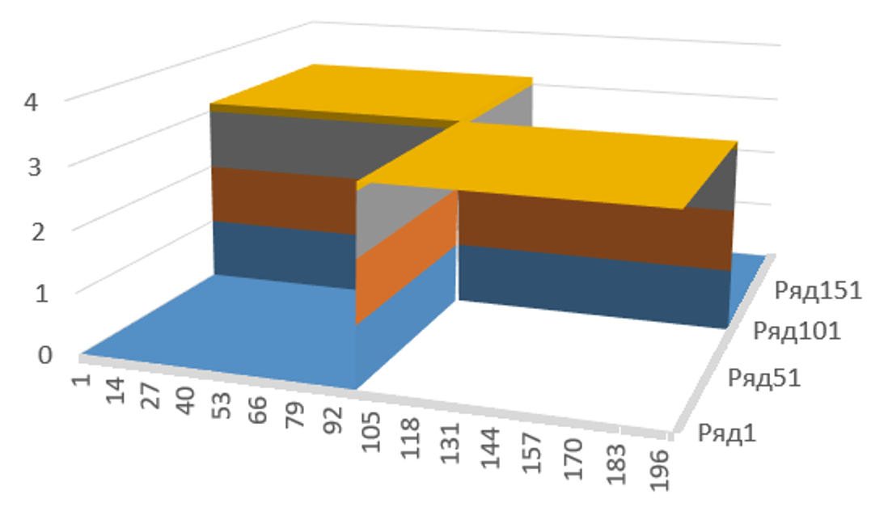

# optics_2

Project crated for learning purposes for optical informatics course
in the university made with
[Java 17](https://jdk.java.net/17/),
[Spring Boot](https://spring.io/projects/spring-boot)
and 
[Vaadin](https://vaadin.com/).

Here I use one-dimensional and two-dimensional 
[Fast Fourier Transformation](https://en.wikipedia.org/wiki/Fast_Fourier_transform)
and
[Discrete Fourier Transformation](https://en.wikipedia.org/wiki/Discrete_Fourier_transform)
on several functions and see how they react.

## One Dimension

This pat uses 
[Vaadin Charts ](https://vaadin.com/docs/latest/ds/components/charts)
for graphical interphase.

First lets see how gauss bundle looks 

As we know, this is the core of any Fourier Transformation.
So, if we pass this as an argument to both transformation methods, the 
only thing that will change is domain area, as we see on pictures below

Now, when we reassured that they have same expected result, we can proceed
to transforming given function: _**2 x exp(-x^2)**_

This is phase and amplitude of function itself

And here is its transformation

Here we can see some strange movements of function phase near domain bundles 
and 0. This happens because phase is defined as _**atan(y/x)**_.
So, when _**x = 0, result -> pi/2**_, and if _**y -> 0, result -> 0**_. 
But actually apache commons library defines calculation of phase of Complex number much 
more difficult.

## Two Dimensions

When we saw how function of one argument reacts to Fast Fourier Transformation, 
we can proceed to transforming function with two arguments: _**4 x y exp(-x^2 - y^2)**_

Here is amplitude and phase of function itself:

Amplitude:

Phase:

Here we can also see some computer accuracy issues.

And here is function's transformation:
Amplitude:

Phase:

